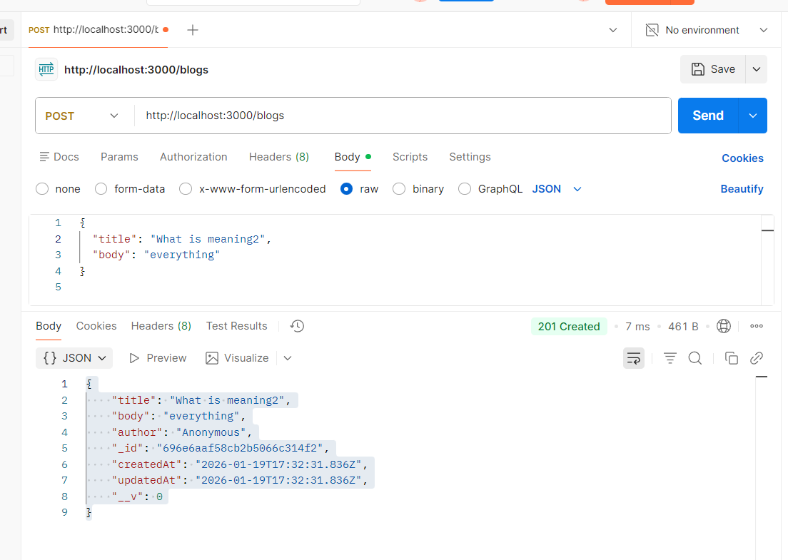
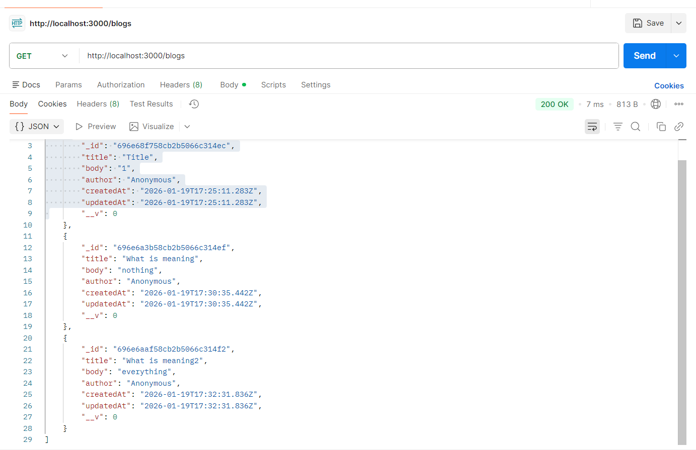
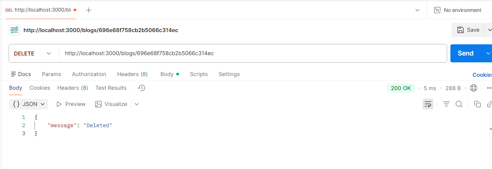
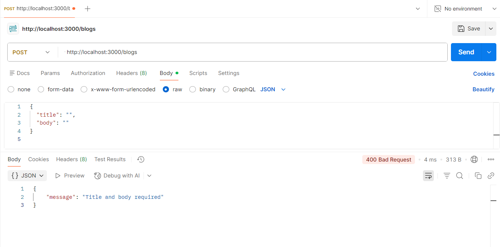
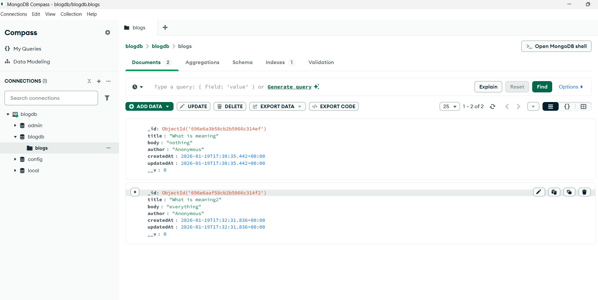
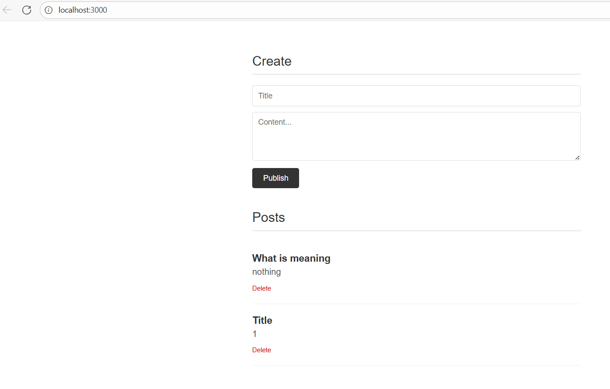

# Blog CRUD API (Assignment 3)
This project is a simple CRUD (Create, Read, Update, Delete) API for a blogging
platform built using Node.js, Express, and MongoDB.
The application allows users to create blog posts, view all posts, delete posts,
and interact with the API through a simple frontend interface and Postman.

---
## Technologies Used

- Node.js
- Express.js
- MongoDB
- Mongoose
- HTML, CSS, JavaScript
- Postman

---

## How to Run the Project

1. Install dependencies:
   npm install

2. Make sure MongoDB is running locally.

3. Start the server:
   node server.js

4. Open the application in the browser:
   http://localhost:3000

---

## API Endpoints

- POST /blogs – Create a new blog post
- GET /blogs – Retrieve all blog posts
- GET /blogs/:id – Retrieve a single blog post
- PUT /blogs/:id – Update a blog post
- DELETE /blogs/:id – Delete a blog post

---

## Data Validation and Error Handling

- Blog posts require both `title` and `body`.
- If required fields are missing, the API returns `400 Bad Request`.
- If a blog post is not found, the API returns `404 Not Found`.
- Successful creation returns `201 Created`.

---

## API Testing with Postman

All CRUD endpoints were tested using Postman.
Screenshots below demonstrate successful requests and error handling.

### Create Blog (POST)

### Get All Blogs (GET)

### Get one blog (GET)

### Update (PUT)

### Delete Blog (DELETE)

### Validation Error (400)

---

## MongoDB Database

MongoDB is used to store blog posts persistently.
Each blog post includes title, body, author, and timestamps.

---

## Frontend Interface

A simple frontend interface is implemented to interact with the CRUD API.
It allows creating and deleting blog posts.

---

## Conclusion

This project demonstrates a fully functional CRUD API with proper validation,
error handling, database integration, and a simple user interface.
